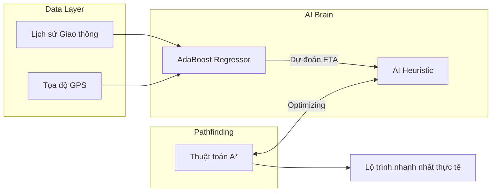

# LogiSense AI: Hệ Thống Quản Trị Logistics Thông Minh Tích Hợp AI

<div align="center">
  
  <br />
  <br />
  <p align="center">
    <b>Giải pháp tối ưu vận tải toàn diện: Kết hợp AdaBoost Regressor & Thuật toán A* để giải quyết bài toán ETA chính xác và Lộ trình thông minh.</b>
  </p>
  
  <div style="display: flex; justify-content: center; gap: 10px; margin-top: 15px;">
    
    
    
  </div>
</div>

---

## 💡 Tầm Nhìn Dự Án

Trong ngành logistics hiện đại, **"Đường ngắn nhất chưa chắc đã là đường nhanh nhất"**. LogiSense AI được thiết kế để phá vỡ giới hạn của các hệ thống định vị truyền thống bằng cách đưa yếu tố dự báo vào mọi quyết định lộ trình. Chúng tôi không chỉ tìm đường, chúng tôi dự đoán tương lai của mỗi chuyến đi thông qua dữ liệu thời gian thực và lịch sử vận hành.

---

## 🚀 Trải Nghiệm Hệ Thống (Feature Walkthrough)

Dưới đây là hành trình tối ưu hóa logistics khép kín mà LogiSense AI mang lại:

### 1️⃣ Giám Sát Hiệu Suất Tổng Thể
Hệ thống bắt đầu với **Dashboard** trực quan, nơi nhà quản lý có cái nhìn 360 độ về toàn bộ hoạt động vận hành, từ các chỉ số KPI quan trọng đến trạng thái đội ngũ shipper.

<div align="center">
  
</div>

### 2️⃣ Quản Lý & Phân Phối Đơn Hàng
Dữ liệu đơn hàng được tập trung hóa, cho phép lọc, ưu tiên và gán việc một cách thông minh dựa trên vị trí và tải trọng của từng nhân viên giao hàng.

<div align="center">
  
</div>

### 3️⃣ Tối Ưu Hóa Bằng Trí Tuệ Nhân Tạo (The Core)
Đây là "bộ não" của hệ thống. Chúng tôi sử dụng mô hình **AdaBoost** để dự báo thời gian (ETA) dựa trên mật độ giao thông, sau đó dùng kết quả này làm "Heuristic" cho thuật toán **A*** để tìm ra lộ trình nhanh nhất.

<div align="center">
  <video src="docs/assets/optimization.mp4" width="90%" autoplay loop muted controls style="border: 1px solid #eee; border-radius: 12px; margin: 20px 0; shadow: 0 4px 12px rgba(0,0,0,0.1);"></video>
  <p><i>Mô phỏng tối ưu hóa lộ trình thời gian thực</i></p>
</div>

<div align="center">
  
  
  <p><i>Giao diện tối ưu hóa đa mục tiêu: Thời gian thực vs. Dự báo AI</i></p>
</div>

### 4️⃣ Điều Hành & Giám Sát Real-time
Sau khi lộ trình được phê duyệt, vị trí của shipper được cập nhật liên tục trên bản đồ, cho phép xử lý ngay lập tức các sự cố phát sinh.

<div align="center">
  
</div>

---

## 🧠 Kiến Trúc Kỹ Thuật (The "Brain")

LogiSense AI sử dụng kiến trúc **Hybrid Intelligence** để đảm bảo cả độ chính xác và tốc độ xử lý:



### Điểm nhấn công nghệ:
- **FastAPI Backend:** Xử lý bất đồng bộ (Async) cho hiệu suất cao.
- **AdaBoost ML Model:** Dự báo ETA với độ chính xác vượt trội so với Google Maps truyền thống trong môi trường đô thị phức tạp.
- **React Modern UI:** Giao diện Dark-mode cao cấp, phản hồi thời gian thực qua WebSockets.

---

## 🛠️ Quản Trị Hệ Thống
Hệ thống cung cấp các bộ công cụ tùy biến sâu cho người quản lý và nhân viên.

<div align="center">
  
  
</div>

---

## 🗺️ Tích Hợp OSRM (Road-Accurate Routing)

LogiSense AI sử dụng **OSRM (Open Source Routing Machine)** để tính toán khoảng cách đường bộ thực tế thay vì Haversine.

### Hướng dẫn chạy OSRM Local:
```bash
# Tải dữ liệu bản đồ
wget https://download.geofabrik.de/asia/vietnam-latest.osm.pbf

# Tiền xử lý (Docker)
docker run -t -v "${PWD}:/data" ghcr.io/project-osrm/osrm-backend osrm-extract -p /opt/car.lua /data/vietnam-latest.osm.pbf
docker run -t -v "${PWD}:/data" ghcr.io/project-osrm/osrm-backend osrm-partition /data/vietnam-latest.osrm
docker run -t -v "${PWD}:/data" ghcr.io/project-osrm/osrm-backend osrm-customize /data/vietnam-latest.osrm

# Chạy Server
docker run -t -i -p 5000:5000 -v "${PWD}:/data" ghcr.io/project-osrm/osrm-backend osrm-routed --algorithm mld /data/vietnam-latest.osrm
```

---

## 📖 Tài Liệu Chi Tiết

| Tài liệu | Nội dung |
| :--- | :--- |
| 📑 [**Tổng Quan**](docs/overview.md) | Triết lý thiết kế & Mục tiêu. |
| 📂 [**Cấu Trúc**](docs/project_structure.md) | Tổ chức mã nguồn. |
| 🧠 [**Thuật Toán**](docs/architecture.md) | Chi tiết AI & Optimization. |
| 🚀 [**Triển Khai**](docs/setup.md) | Hướng dẫn cài đặt Docker. |
| 📘 [**User Guide**](docs/user_guide.md) | Hướng dẫn sử dụng cho người cuối. |

---
<div align="center">
  <p>Được phát triển bởi <b>Senior Engineering Team</b></p>
  <p>© 2026 LogiSense AI. Smart Logistics for a Smarter World.</p>
</div>
