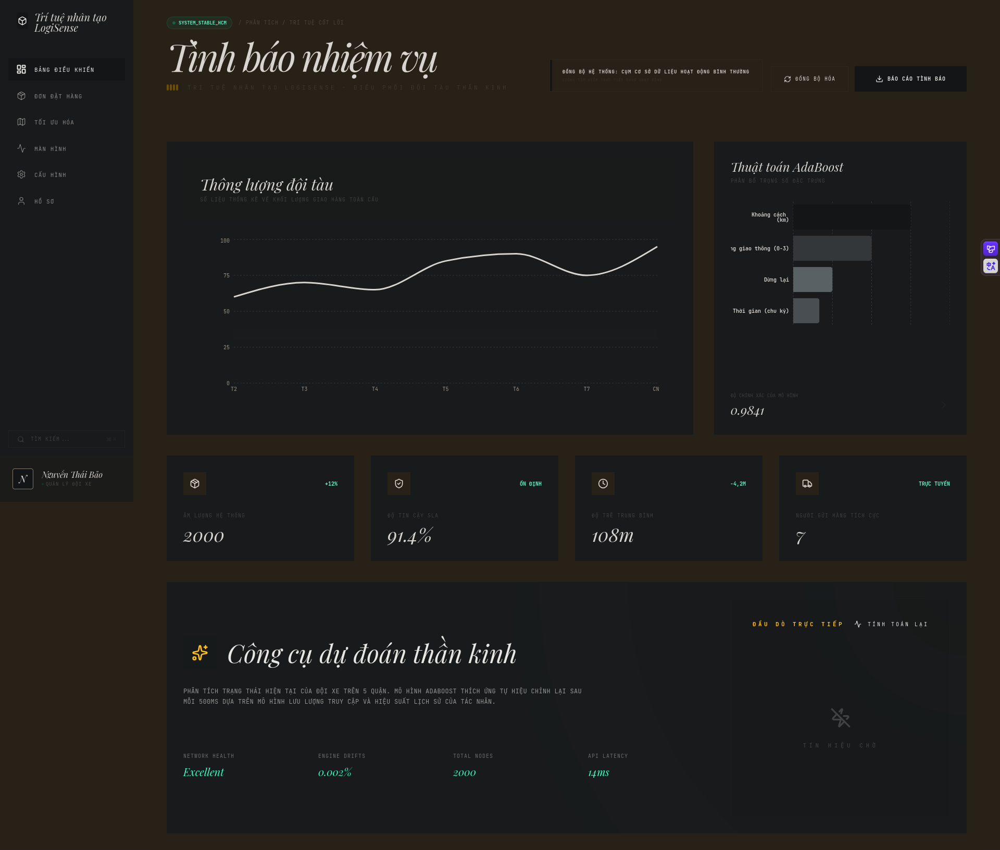
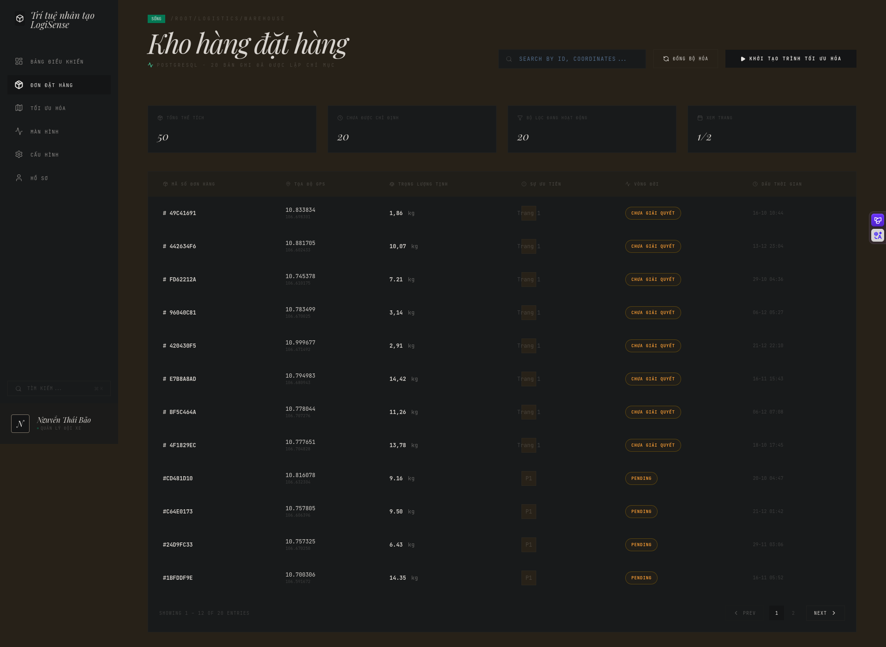
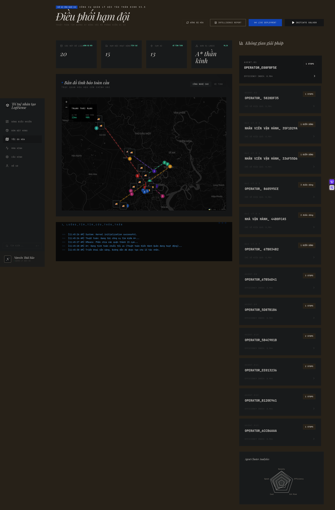
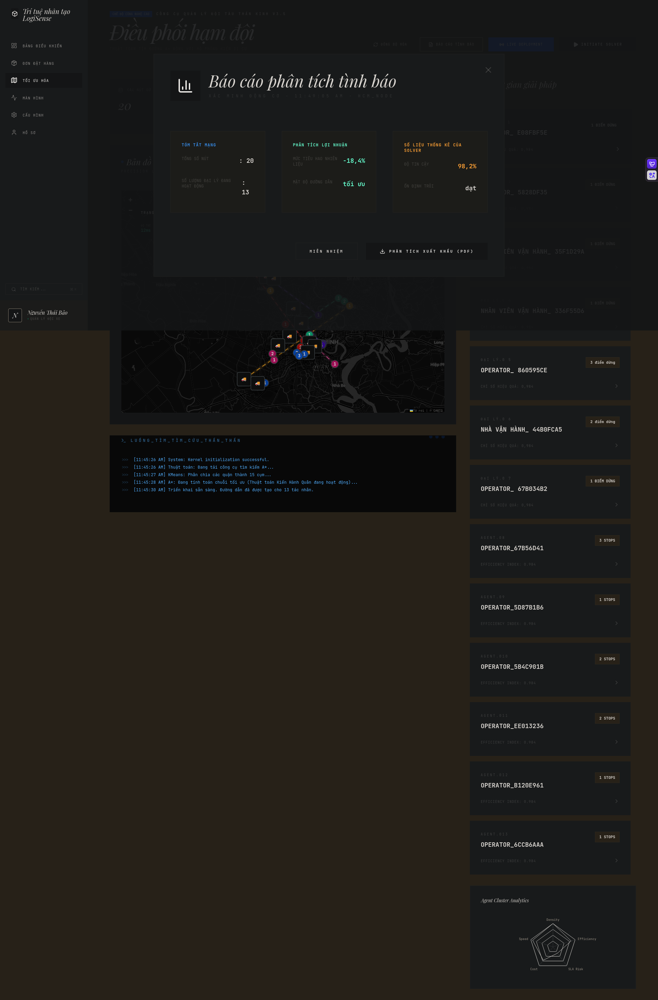
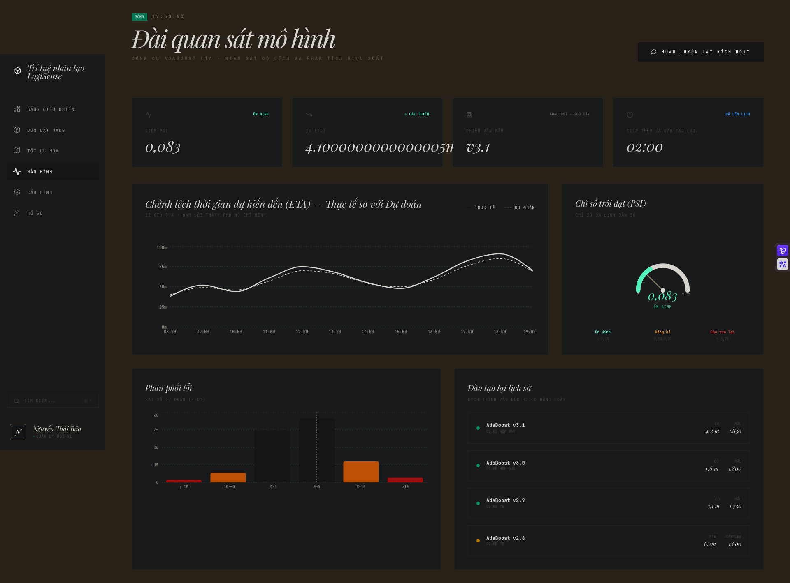
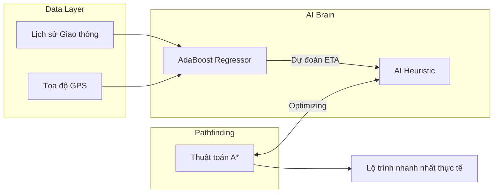
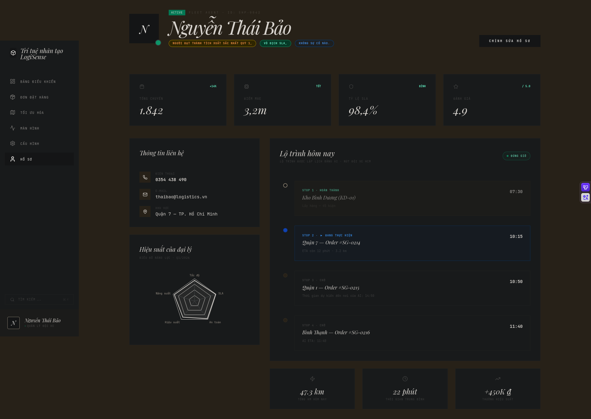
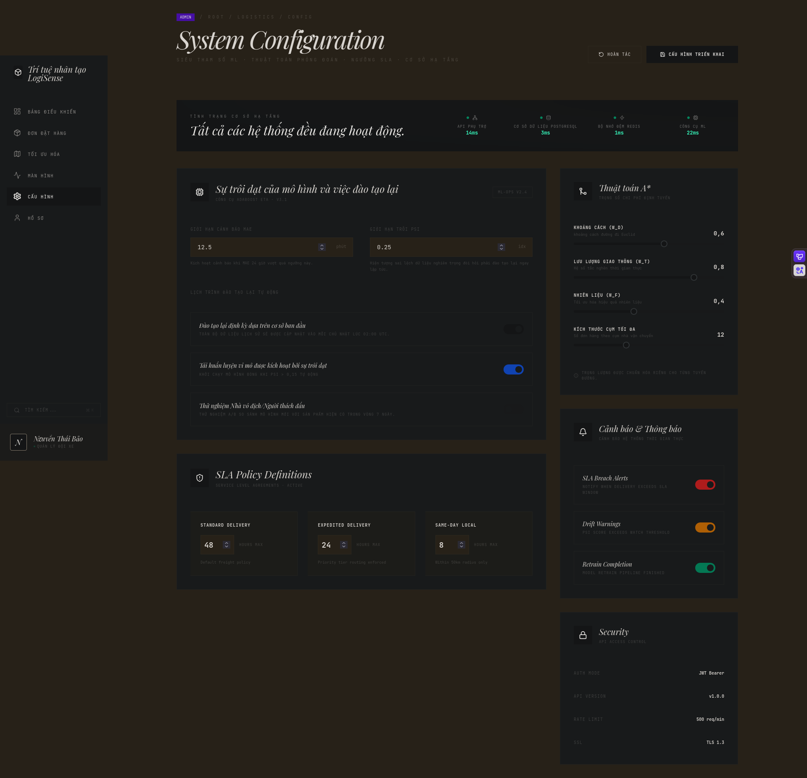

# LogiSense AI: Hệ Thống Quản Trị Logistics Thông Minh Tích Hợp AI

  
   
  

    <b>Giải pháp tối ưu vận tải toàn diện: Kết hợp AdaBoost Regressor & Thuật toán A* để giải quyết bài toán ETA chính xác và Lộ trình thông minh.</b>
  

  
  
  
  
  

---

## 💡 Tầm Nhìn Dự Án

Trong logistics hiện đại, **"Đường ngắn nhất chưa chắc đã là đường nhanh nhất"**. LogiSense AI được thiết kế để phá vỡ giới hạn của các hệ thống định vị truyền thống bằng cách đưa yếu tố dự báo vào mọi quyết định lộ trình. Chúng tôi không chỉ tìm đường, chúng tôi dự đoán tương lai của mỗi chuyến đi.

---

## 🚀 Trải Nghiệm Hệ Thống (Feature Walkthrough)

Hãy cùng khám phá cách LogiSense AI vận hành thông qua quy trình 4 bước khép kín:

### Bước 1: Giám Sát Hiệu Suất Tổng Thể
Hệ thống bắt đầu với **Dashboard** trực quan, nơi nhà quản lý có cái nhìn 360 độ về toàn bộ hoạt động vận hành, từ các chỉ số KPI quan trọng đến trạng thái đội ngũ shipper.

  

### Bước 2: Quản Lý & Phân Phối Đơn Hàng
Dữ liệu đơn hàng được tập trung hóa, cho phép lọc, ưu tiên và gán việc một cách thông minh dựa trên vị trí và tải trọng của từng nhân viên giao hàng.

  

### Bước 3: Tối Ưu Hóa Bằng Trí Tuệ Nhân Tạo (The Core)
Đây là "bộ não" của hệ thống. Chúng tôi sử dụng mô hình **AdaBoost** để dự báo thời gian (ETA) dựa trên mật độ giao thông và thời gian trong ngày, sau đó dùng kết quả này làm "Heuristic" cho thuật toán **A*** để tìm ra lộ trình nhanh nhất.

  <video src="docs/assets/optimization3.mp4" width="100%" autoplay loop muted controls style="border: 1px solid #eee; border-radius: 8px;"></video>
  
<i>Mô phỏng tối ưu hóa lộ trình thời gian thực</i>

  
  
  
<i>Giao diện tối ưu hóa đa mục tiêu: Thời gian thực vs. Dự báo AI</i>

### Bước 4: Điều Hành & Giám Sát Real-time
Sau khi lộ trình được phê duyệt, hệ thống chuyển sang chế độ giám sát. Vị trí của shipper được cập nhật liên tục trên bản đồ, cho phép xử lý ngay lập tức các sự cố phát sinh.

  

---

## 🧠 Kiến Trúc Kỹ Thuật (The "Brain")

LogiSense AI sử dụng kiến trúc **Hybrid Intelligence** để đảm bảo cả độ chính xác và tốc độ xử lý:

### Điểm nhấn kỹ thuật:
- **Zero-Latency Inference:** Mô hình ML được nạp sẵn vào bộ nhớ (Singleton Pattern), phản hồi dự báo trong < 5ms.
- **Asynchronous Processing:** Tách biệt luồng tính toán nặng (Optimization) khỏi luồng API bằng Python Async/Await & ThreadPool.
- **Scalable Infrastructure:** Sẵn sàng triển khai với Docker, hỗ trợ Redis Caching để tăng tốc các yêu cầu lặp lại.

---

## 🛠️ Cấu Hình & Quản Trị
Hệ thống cho phép tùy biến sâu từ hồ sơ người dùng đến các tham số vận hành, đảm bảo linh hoạt cho nhiều mô hình kinh doanh khác nhau.

  
  

---

## 📖 Tài Liệu Tham Chiếu

| Tài liệu | Nội dung chính |
| :--- | :--- |
| 📑 [**Tổng Quan**](docs/overview.md) | Mục tiêu, công nghệ và tính năng cốt lõi. |
| 📂 [**Cấu Trúc**](docs/project_structure.md) | Tổ chức thư mục và kiến trúc Module. |
| 🧠 [**Thuật Toán**](docs/architecture.md) | Chi tiết về AdaBoost, A* và luồng dữ liệu ML. |
| 🚀 [**Triển Khai**](docs/setup.md) | Hướng dẫn Docker và cấu hình môi trường. |
| 📘 [**Hướng Dẫn Sử Dụng**](docs/user_guide.md) | Hướng dẫn nạp dữ liệu và huấn luyện lại AI. |

---

  
Được phát triển bởi <b>Senior Engineering Team</b>

  
© 2026 LogiSense AI. Smart Logistics for a Smarter World.

